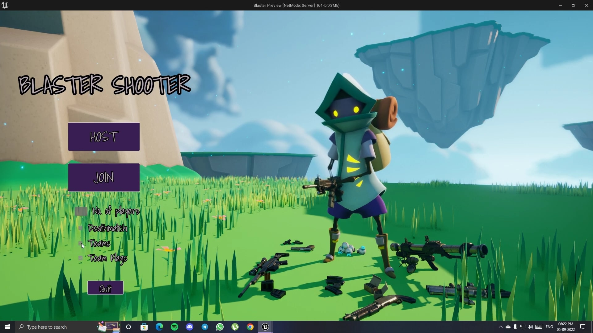
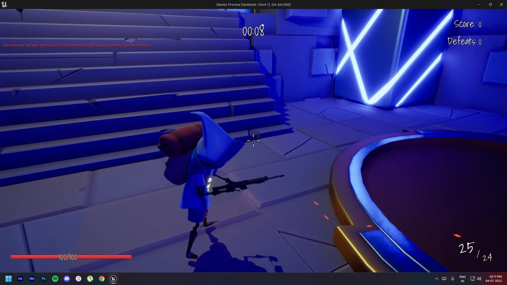
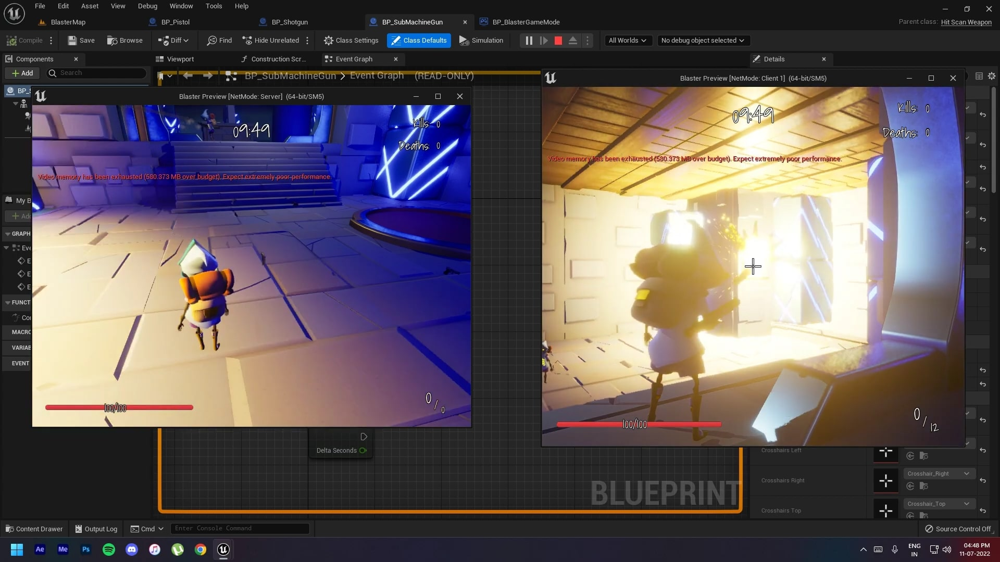
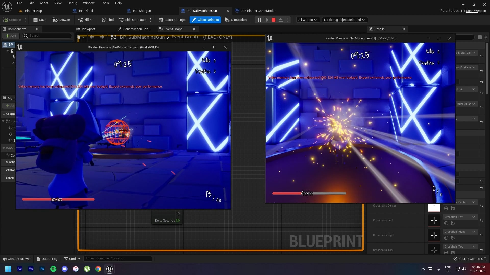

# Blaster--Multiplayer-Shooter-
Developing various multiplayer logics like lag-compensation, hit-boxes, and server-side using a custom-made multiplayer plugin while using advanced C++ concepts like interfaces, and abstract methods in coherence with blueprints. Also designing clean slate UI and a basic multiplayer level for play-testing between multiple players in Unreal Engine.

## Motivation
A new multiplayer game project on the journey of learning Unreal Engine 5 with C++ and Blueprints. 
See the project in action here => https://youtube.com/playlist?list=PLCXXIoh9PICXAz0sJXaGVvJW8J4NqX9EX

# Screenshots

## License
[MIT](https://choosealicense.com/licenses/mit/)
